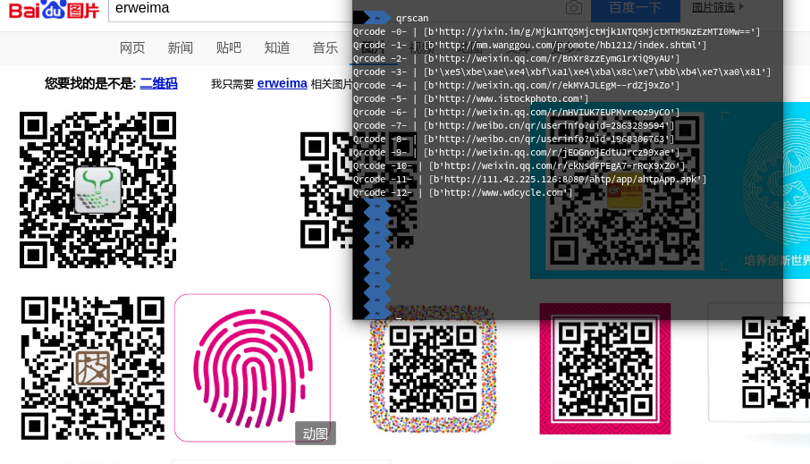

# QrcodeScanner

[](http://forthebadge.com)  

a python project to read qrcode on screen



## How to use

1. install depends

```shell
# ubuntu/debian
sudo apt-get install libpython3-dev
sudo apt-get install libzbar-dev
# or centos/fedora/suse
sudo dnf install python3-devel
sudo dnf install zbar-devel
# install python modules
python3 -m pip install -r requirements.txt
```

2. execute install.sh

    `sudo ./install.sh`
